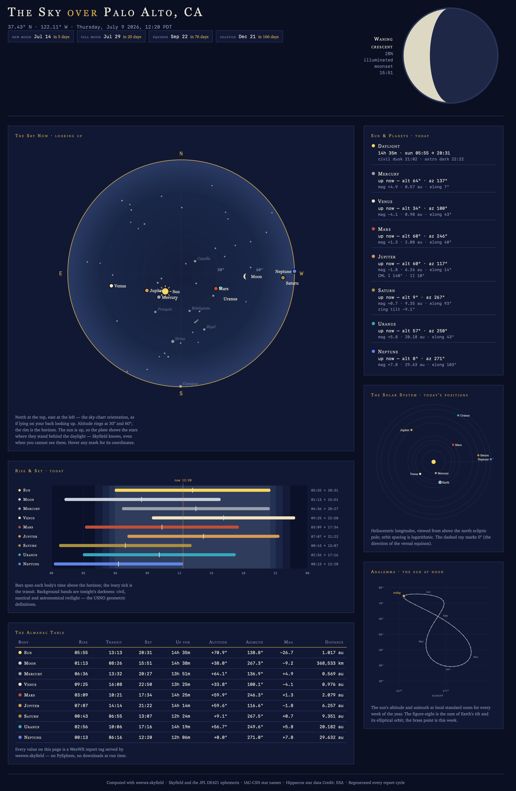

# weewx-skyfield
*Open source plugin for WeeWX software.

Copyright (C)2022-2026 by John A Kline (john@johnkline.com)

**This extension requires Python 3.9 or later, WeeWX 5.2 or later, and the
[Skyfield](https://rhodesmill.org/skyfield/) (1.47 or later) and NumPy libraries.  PyEphem is
NOT required.**


## Description

weewx-skyfield replaces WeeWX's built-in almanac (PyEphem or weeutil) for report
generation.  Report tags such as `$almanac.sunrise`, `$almanac.moon.transit`,
`$almanac(horizon=-6).sun(use_center=1).rise` and `$almanac.next_full_moon` (as used, for
example, in the Seasons skin's Celestial page) are computed with Skyfield and JPL's DE421
ephemeris, which is installed with the extension — no downloads at runtime, and *much* more
accurate values than PyEphem, which is deprecated by its own author in favor of Skyfield.

### The Sky page



Installing the extension also installs **The Sky** — a one-page, planetarium-style showcase
generated by the bundled `Skyfield` skin at `<HTML_ROOT>/skyfield/index.html`.  Everything on
it is computed for *your* station's location and elevation, taken automatically from
`weewx.conf`:

- a **sky dome** of everything above your horizon right now — the sun, the moon drawn at its
  true phase, the planets, and the bright IAU-named stars sized by magnitude, with hover
  coordinates on every mark (when the sun is up, the stars are shown dimmed, standing where
  they are behind the daylight);
- today's **rise & set ribbons** for the sun, moon and planets, over civil/nautical/
  astronomical twilight bands, with transit ticks and a "now" line;
- an **orrery** of today's heliocentric longitudes, viewed from above the ecliptic;
- an **analemma** — the sun's altitude and azimuth at local standard noon for every week of
  the year, with this week's point marked;
- moon phase and illumination, countdowns to the next equinox, solstice, new and full moon,
  Jupiter's central meridian longitudes, Saturn's ring tilt, and a full almanac table.

The page is self-contained HTML and inline SVG — no JavaScript libraries, no web fonts, and
nothing fetched at run time — so it requires nothing beyond what the extension already
requires, works offline, and renders fine on a Raspberry Pi.  It regenerates with live values
every report cycle; it is the most computation-hungry page in a typical install (the analemma
alone evaluates the almanac 53 times), so if your archive interval is short you can generate
it less often by setting `report_timing` in the `[[SkyfieldReport]]` section of
`weewx.conf`.  To skip generating it entirely, set `enable = false` there.

Skins embedding the panels themselves can pick the colors baked into the markup with each
render method's optional `palette` argument — `'night'` (the default, shown above) or
`'light'`, a paper-atlas plate for light-themed pages: `$sky_page.analemma_svg($almanac,
palette='light')`.  `dome_svg` additionally takes `label_scale` (default 1.0), which grows
every dome label by that factor with the collision layout following along — useful when a
skin displays the chart scaled down, such as a fixed-canvas smartphone page:
`$sky_page.dome_svg($almanac, palette='light', label_scale=2.2)`.

The Skyfield almanac natively computes, for the sun, the moon and all planets (plus Pluto):
rise/set/transit (including `next_`/`previous_` rising, setting, transit and antitransit), custom
horizons and `use_center` (for twilight tags), azimuth/altitude, right ascension/declination
(topocentric, astrometric and geocentric), heliocentric longitude/latitude, elongation, earth and
sun distance, visible time and its day-over-day change, magnitude (`$almanac.venus.mag`), percent
illuminated (`$almanac.venus.phase`), apparent angular size (`$almanac.sun.size`,
`$almanac.moon.radius_size`), `circumpolar`/`neverup`, parallactic angle and sidereal time; the
moon's libration and selenographic colongitude, Jupiter's central meridian longitudes and Saturn's
ring tilt; as well as equinoxes, solstices, moon phases and the moon index.  PyEphem is *not*
required for any of these, nor for any tag used by WeeWX's standard skins.

Named stars (e.g., `$almanac.rigel.rise`, `$almanac.polaris.circumpolar`, `$almanac.sirius.mag`)
are also computed natively.  The names are the official proper names of the IAU Catalog of
Star Names (every entry of the Working Group on Star Names' IAU-CSN list with a Hipparcos
number), plus PyEphem's 115 star names for backward compatibility (a few of those are legacy
spellings of the same stars, e.g. `albereo` for `albireo`) — 420 names in all, covering 412
stars.  Multi-word names use underscores and diacritics are dropped
(`$almanac.kaus_australis.rise`, `$almanac.barnards_star.mag`).  Any other Hipparcos star can be
addressed by catalog number: `$almanac.hip_57939.rise`.  The star positions, proper motions,
parallaxes and magnitudes come from `wxskyfield_stars.dat`, an excerpt of the Hipparcos Catalogue
(The Hipparcos and Tycho Catalogues, ESA SP-1200, 1997; distributed by CDS as VizieR catalog
I/239) which is installed along with the extension; install a full `hip_main.dat` alongside it to
serve all 118,218 Hipparcos stars.  Unlike PyEphem, `earth_distance` and `sun_distance` work for
stars (in astronomical units, like the planets — e.g., `$almanac.proxima_centauri.earth_distance`),
computed from the star's Hipparcos parallax.  Star support can be turned off by setting
`stars = false` in the `Skyfield` section of `weewx.conf`.

Anything this extension does not compute falls through to the next almanac in WeeWX's list —
the built-in PyEphem almanac when PyEphem is installed (e.g., named stars when the star catalog
is disabled, or direct PyEphem body attributes such as `$almanac.moon.subsolar_lat`).  Almanac
times outside the span of the bundled DE421 ephemeris (mid-1899 through 2053) fall through the
same way.  Without PyEphem, such tags simply report per-tag errors rather than breaking report
generation.

### Differences from PyEphem

Where PyEphem and standard astronomical conventions differ, weewx-skyfield follows the standard
definitions rather than PyEphem:

- A custom horizon (e.g., `$almanac(horizon=-6)`) is treated as a geometric altitude: no
  atmospheric refraction is applied.  This matches the USNO definitions of civil, nautical and
  astronomical twilight.  (PyEphem applies refraction to a custom horizon unless the `pressure=0`
  idiom is used, which shifts twilight times by roughly 2-3 minutes.)  With the default horizon,
  rise and set include standard refraction (34 arcminutes) and the body's apparent radius, and
  `circumpolar`/`neverup` are judged against that same effective horizon, so they always agree
  with rise/set.  Note that an explicit `horizon=0` cannot be distinguished from the default
  (WeeWX supplies 0.0 when no horizon is given), so it receives the default refraction-and-radius
  treatment; for the geometric crossing of the true horizon, use `pressure=0` with
  `use_center=1`.
- `hlongitude`/`hlatitude` are true heliocentric (sun-centered) ecliptic coordinates for every
  body, including the moon.  (PyEphem reports the moon's *geocentric* ecliptic longitude under
  this name.)  For the sun itself, heliocentric coordinates are undefined, so Earth's heliocentric
  coordinates are reported, per the XEphem convention.
- The default horizon honors the almanac's `pressure` and `temperature` for rise/set: refraction
  is scaled from the standard 34 arcminutes, and WeeWX's documented `pressure=0` idiom turns it
  off entirely.
- `$almanac.separation()` takes two `(longitude, latitude)` tuples in radians and returns radians,
  per the WeeWX 5.2 almanac API.  It also accepts two of this almanac's own body binders —
  `$almanac.separation($almanac.mars, $almanac.venus)` — computed natively.  Calls made with
  PyEphem `Body` arguments are passed through to PyEphem when it is installed.
- Jupiter's central meridian longitudes (`$almanac.jupiter.cmlI`/`cmlII`) are computed from the
  IAU rotation elements (pole and System I/II rotation rates) and the light-time corrected
  geometry.  PyEphem's values differ from the IAU definition by about 0.8 degrees.
- The moon's libration (`libration_lat`/`libration_long`) and selenographic colongitude
  (`colong`) are the optical libration per Meeus, Astronomical Algorithms ch. 53; the physical
  libration (at most 0.04 degrees) is neglected.  Saturn's ring tilt (`earth_tilt`/`sun_tilt`)
  follows Meeus ch. 45.  All are in radians, like PyEphem's.

### Relationship to other extensions

- [weewx-celestial](https://github.com/chaunceygardiner/weewx-celestial) (same author) inserts
  celestial observations into loop packets for live-updating reports.  As of celestial 4.0 the
  two extensions are complementary and coexist with no configuration: celestial provides the
  loop fields, weewx-skyfield provides the report almanac (celestial's own report tags come out
  the same, since both compute from the same definitions).  Only celestial 3.x, which embedded
  this same almanac engine, needs `replace_builtin_almanac = false` in the `[Celestial]` section
  of `weewx.conf` when run alongside weewx-skyfield, so that only one Skyfield almanac is
  registered (they would compute identical values; there is just no reason to load the 17 MB
  ephemeris twice).
- weewx-skyfield-almanac (by a different author) is an independent Skyfield almanac extension
  with a different design (it downloads its ephemerides and catalogs at runtime).  Choose one or
  the other; installing both would leave reports using whichever registered last.

# Installation Instructions

1. If pip install,
   Activate the virtual environment (actual syntax varies by type of WeeWX install):
   `/home/weewx/weewx-venv/bin/activate`
   Install the prerequisite skyfield package (1.47 or later is required).
   `pip install 'skyfield>=1.47'`

1. If package install:
   Install the prerequisite skyfield package.  On debian, that can be accomplished with:
   `sudo apt install python3-skyfield`
   Skyfield 1.47 or later is required (`apt show python3-skyfield` reports the version;
   Debian 12 "bookworm" ships 1.45, which is too old — use pip in that case).  On an older
   Skyfield, the extension logs an error and leaves the built-in almanac in place.

1. Download the latest release, weewx-skyfield.zip, from
   [weewx-skyfield GitHub Repository](https://github.com/chaunceygardiner/weewx-skyfield).

1. Install the skyfield extension.

   `weectl extension install weewx-skyfield.zip`

1. Restart WeeWX.

Reports generated from then on (e.g., the Seasons skin's Celestial page) use Skyfield almanac
values.  No skin changes are needed: the extension answers the same `$almanac` tags as the
built-in almanac.  The Sky page appears alongside your existing reports at
`<HTML_ROOT>/skyfield/index.html` after the first report cycle.

## Entries in `Skyfield` section of `weewx.conf`:

```
[Skyfield]
    enable = true
    stars = true
```

(This is weewx-skyfield's own top-level `[Skyfield]` section.  It is unrelated to the
`[[Skyfield]]` subsection of `[Almanac]` used by the independent weewx-skyfield-almanac
extension.)

 * `enable`: When true (the default), the Skyfield almanac is registered and reports are
   generated with Skyfield almanac values rather than WeeWX's built-in PyEphem/weeutil almanac.
 * `stars` : When true (the default), named stars (e.g., `$almanac.rigel.rise`) are available
   in the report almanac, computed from the bundled Hipparcos catalog excerpt
   (`wxskyfield_stars.dat`).

## Serving every Hipparcos star

The bundled `wxskyfield_stars.dat` covers the 412 named stars.  To address *any* Hipparcos star
by catalog number (`$almanac.hip_57939.rise`), download the full Hipparcos catalog `hip_main.dat`
(from [CDS VizieR I/239](https://cdsarc.cds.unistra.fr/viz-bin/cat/I/239)) and place it in
WeeWX's user directory (e.g., `/home/weewx/bin/user/hip_main.dat`).  When present, `hip_<number>`
lookups read it and all 118,218 stars are served.  (The named stars are still loaded from the
bundled excerpt at startup — its records are identical to the full catalog's, and reading the
excerpt keeps startup fast.)

## Testing

A pytest test suite lives in the `tests` directory.  It exercises the Skyfield almanac
(sun/moon rise/set/transit, twilight horizons, equinoxes/solstices, moon phases, positions,
magnitudes/sizes/phases, named stars, and polar day/night edge cases).  It also contains two
permanent audits: one verifying that, with PyEphem installed, everything WeeWX's built-in almanac
can do still works (including direct PyEphem attributes such as `$almanac.moon.subsolar_lat`);
and one verifying that on a system *without* PyEphem, all standard-skin tags (and much more) work
with Skyfield alone.  Run the suite from the root of this repository with the Python from your
WeeWX virtual environment (WeeWX, Skyfield and pytest must be installed in that environment):

```
/home/weewx/weewx-venv/bin/python -m pytest tests
```

The star tests use the bundled Hipparcos catalog excerpt (`bin/user/wxskyfield_stars.dat`),
which is part of this repository, so no additional downloads are needed.

## Why require Python 3.9 or later?

weewx-skyfield uses timezone aware date features which do not work with Python 2, nor in
versions of Python 3 earlier than 3.9.

## Licensing

weewx-skyfield is licensed under the GNU Public License v3.
